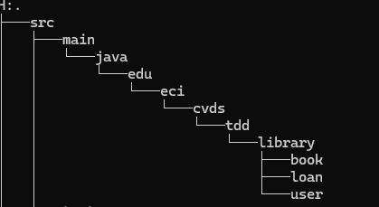
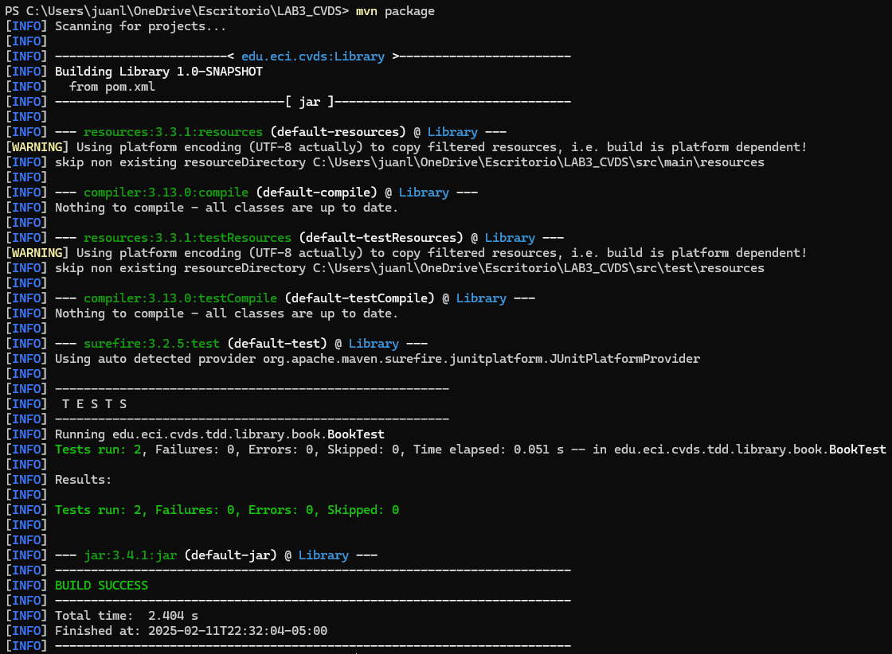
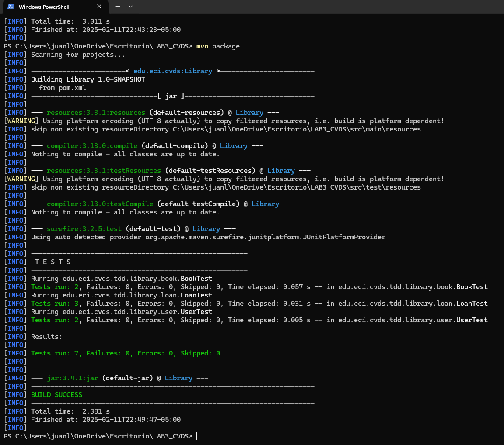
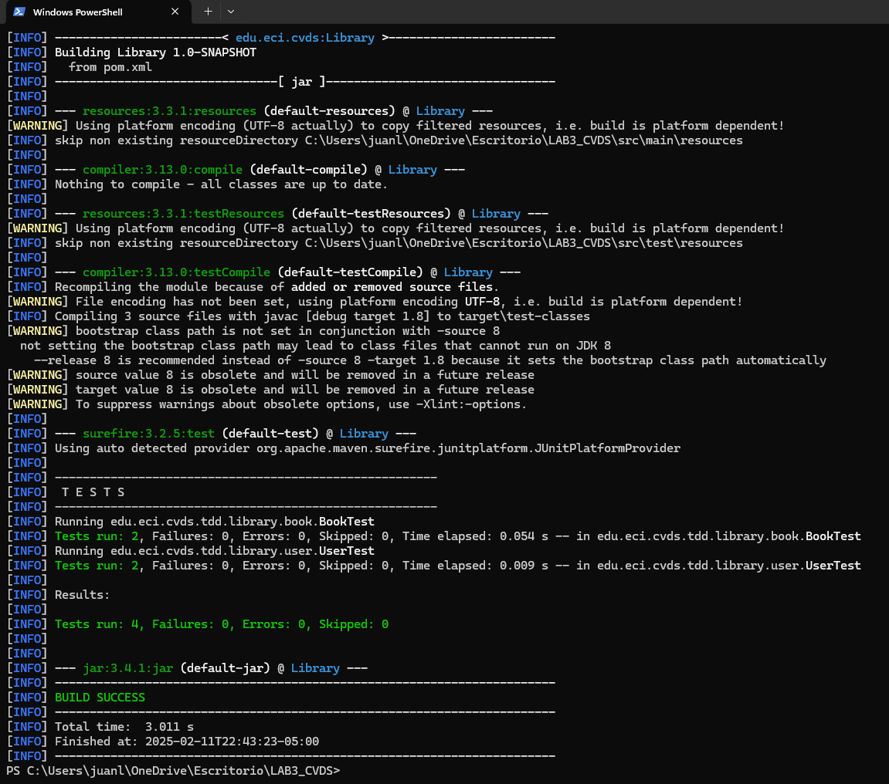
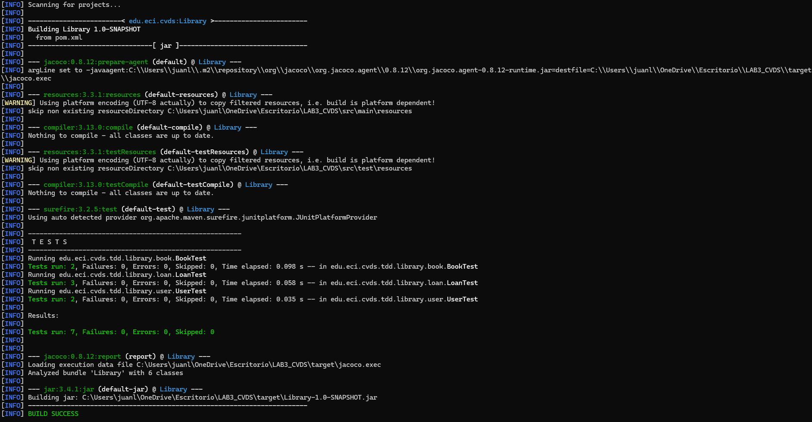

# CVDS Grupo No.3 | Laboratorio #3 - TDD SONARQUBE & JACOCO

### Enunciado Oficial: [LAB3 CVDS Company](https://github.com/CVDS-ESCUELAING/Laboratory2025/blob/main/LAB03.md)


### Integrantes
- [Sergio Andrey Silva Rodríguez](https://github.com/OneCode182) (Owner)
- [Juan Esteban Lozano Cárdenas](https://github.com/juanLozano-2004) (Collaborator)

## Construccion Proyecto
### Crear Proyecto Maven
Crear un proyecto maven con los siguientes parámetros:
```yml
Grupo: edu.eci.cvds 
Artefacto: Library 
Paquete: edu.eci.cvds.tdd 
archetypeArtifactId: maven-archetype-quickstart 
```

Para ello, se usa el siguiente comando:

```sh
mvn archetype:generate \
  -DgroupId=edu.eci.cvds \
  -DartifactId=Library \
  -Dpackage=edu.eci.cvds.tdd \
  -DarchetypeArtifactId=maven-archetype-quickstart \
  -DinteractiveMode=false
```

### Agregando Dependencias
- Buscar en maven central la dependencia de JUnit5 en su versión más reciente.
[JUnit5-Maven-Central](https://mvnrepository.com/artifact/org.junit.jupiter/junit-jupiter-api/5.11.4)

La version mas reciente y estable de JUnit5 encontrada en Maven Central es la `5.11.4`. 

- Edite el archivo `pom.xml` del proyecto para agregar la dependencia.

Agregar la dependencia en la etiqueta `dependencies`:
```xml
<!-- JUnit Jupiter API for JUnit 5 -->
<!-- https://mvnrepository.com/artifact/org.junit.jupiter/junit-jupiter-api -->
<dependency>
    <groupId>org.junit.jupiter</groupId>
    <artifactId>junit-jupiter-api</artifactId>
    <version>5.11.4</version>
    <scope>test</scope>
</dependency>
```

- Compile el proyecto para validar que todo este bien.
```sh
mvn clean package
```

### AGREGAR ESQUELETO DEL PROYECTO
Cree los siguientes paquetes dentro de `edu.eci.cvds.tdd`
- library
  - book
  - loan
  - user

El scaffolding del proyecto deberia quedar asi



*NOTA:* Estos paquetes también se deben crear en la carpeta de test.

### AGREGAR CLASES 

Nos situamos a la raiz del directorio de paquetes: `edu.eci.cvds.tdd.library`

*NOTA:* Los codigos estan disponibles en el `README.md` oficial: [LAB3 CVDS Company](https://github.com/CVDS-ESCUELAING/Laboratory2025/blob/main/LAB03.md)

En el paquete `book` cree la clase `Book.java`:

A continuación en el paquete `user` cree la siguiente clase `User.java`:

En el paquete `loan` se deben crear las clases `Loan.java` y el enum `LoanStatus.java`:

por último se debe crear la siguiente clase en el paquete actual: `Library.java`

Para validar que la estructura del proyecto está bien se debe compilar usando el comando:

```sh
mvn package
```


## PRUEBAS UNITARIAS Y TDD
Para poder implementar los métodos `addBook`, `loanABook` y `returnLoan` de la clase `Library` vamos a aplicar la técnica de TDD, por cada caso de prueba se debe hacer un commit, cada commit debe tener la prueba nueva y la implementación para que la prueba del commit funcione. Las pruebas anteriormente implementadas deben continuar funcionando.
Como están trabajando en parejas es necesario trabajar en ramas independientes y utilizar Pull Request para mezclar los cambios.

```sh
Test de la prueba unitaria book
```


```sh
Test de la prueba unitaria loan
```


```sh
Test de la prueba unitaria user
```



## CREAR CLASE DE PRUEBA
Es necesario crear la clase de prueba para ```edu.eci.cvds.tdd.Library```, la clase debe seguir los estándares de nombres estudiados en clase.

Para pensar en los casos de pruebas lean detenidamente el javadoc de los métodos para reconocer las clases de equivalencia, basados en las clases de equivalencia se debe crear una prueba la cual debe fallar y posteriormente implementar el código necesario para que funcione, este proceso se debe repetir hasta cumplir con la especificación definida en el javadoc.

### Realizamos la prueba de verificación del build en jacoco luego de las pruebas de unidad


